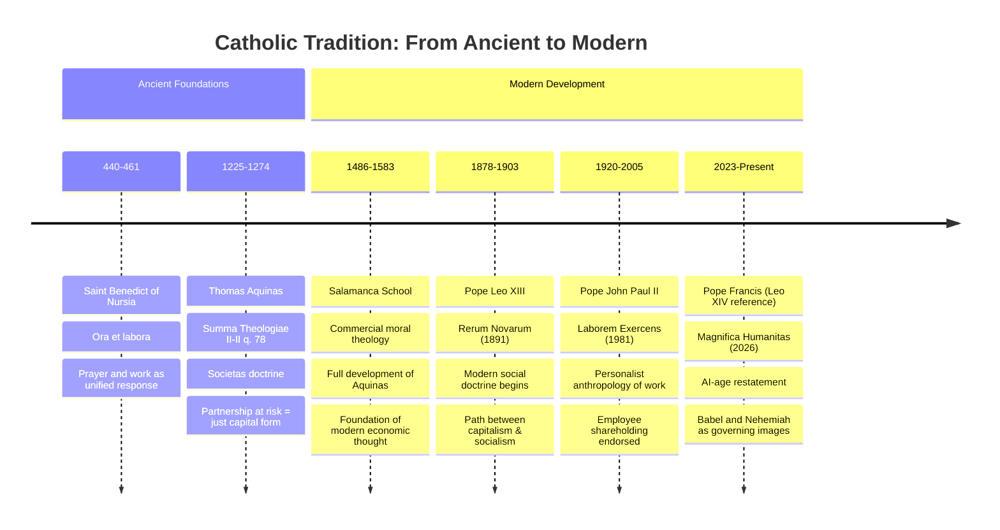

# Doctrinal Lineage: A Living Tradition

The LEP intellectual framework draws from two complementary religious and philosophical traditions that converge on a single answer: **partnership is the just form of capital**.

---

## Catholic tradition: from Roman law to *Magnifica Humanitas*

---

## Catholic tradition: figure notes

Each figure below contributed a distinct move: from the dignity of work (Benedict), to the doctrinal distinction (Aquinas), to the commercial moral theology (Salamanca), to the modern social-encyclical arc (Leo XIII through Leo XIV).

### Saint Benedict (440-461)
**Work:** Rule of Saint Benedict  
**Key Concept:** *Ora et labora* (Prayer and Work)

The foundational principle: work and prayer are united as the human response to God. Labor is dignified, not degrading. This forms the philosophical foundation for all subsequent Catholic economic thought.

### Thomas Aquinas (1225-1274)
**Work:** Summa Theologiae II-II q. 78  
**Key Concept:** *Societas* (Partnership at Shared Risk)

Aquinas drew on Roman commercial law to argue that **partnership at shared risk is the just form of capital deployment**, in contrast to *mutuum* (fixed-interest lending). This is the cornerstone of the LEP framework.

**Why Societas is just:**
- Risk is shared, not externalized
- Partners' interests are aligned
- Profit reflects actual contribution
- Dignity of all participants is honored

### Salamanca School (1486-1583)
**Figures:** Francisco de Vitoria, Domingo de Soto, Luis de Molina  
**Key Work:** Commercial moral theology

The Salamanca School developed Aquinas's *societas* doctrine into a comprehensive theology of commercial partnership. They applied scholastic philosophy to emerging market economies and established principles that remain relevant 500 years later.

### Pope Leo XIII (1810-1903)
**Work:** *Rerum Novarum* (1891)  
**Key Concept:** Modern Social Doctrine

Leo XIII brought Catholic moral teaching into dialogue with industrial capitalism. He rejected both unbridled capitalism and socialism, charting a third path: **just capital deployment through authentic partnership**.

### Pope John Paul II (1920-2005)
**Work:** *Laborem Exercens* (1981)  
**Key Concept:** Personalist Anthropology of Work

JPII reframed work through a personalist lens: the person is the subject of work, not its object. Notably, Section 14 explicitly endorses **employee shareholding** as a model where workers share in ownership, risk, and reward.

### Pope Leo XIV and *Magnifica Humanitas* (2026)
**Recent Work:** *Magnifica Humanitas* (2026)  
**Key Concepts:** AI Age Restatement; Babel and Nehemiah

The most recent articulation of this lineage addresses the challenges of artificial intelligence and algorithmic capitalism. Using Babel (fragmentation, misalignment) and Nehemiah (rebuilding through community) as governing images, it asks: how do we ensure AI serves partnership rather than extraction?

---

## Jewish tradition: Torah to Maimonides to the *heter isqa*

The Jewish tradition arrives at the same destination through different paths.

### Biblical Foundations

**Leviticus 25:35-36**  
*"So that he may live with you..."*

The verse that grounds the partnership obligation. It's not charity as relief; it's sustenance as dignity. The poor person should live *with you*, as a partner in the community, not as an object of pity.

**Deuteronomy 16:20**  
*"Justice, justice shall you pursue..."*

The doubled imperative. Justice pursued through just means. The "how" matters as much as the "what."

### Maimonides (1138-1204)
**Work:** Mishneh Torah, Hilkhot Mattenot Aniyim 10:7-14  
**Key Concept:** Eight Rungs of *Tzedakah*

Maimonides ranked eight levels of charity (*tzedakah*), ascending from anonymous giving to **partnership** (*shutafut*) with the recipient. The highest form isn't giving *to* the poor; it's engaging *with* them as partners in creating their own livelihood.

The eight rungs, from lowest to highest:

1. **Giving reluctantly** - the donor's heart is pained
2. **Giving with a smile** - cheerful giving, but still one-directional
3. **Giving *after* being asked** - passive response
4. **Giving *before* being asked** - proactive but still one-directional
5. **Giving where the recipient knows the donor, but the donor doesn't know the recipient** - anonymity for the giver's benefit
6. **Giving where the donor knows the recipient, but the recipient doesn't know the donor** - anonymity for the recipient's benefit
7. **Giving where neither party knows the other** - complete anonymity
8. **Partnership (*shutafut*)** - enabling the poor person to support themselves through employment or business partnership

**Why partnership is highest:** It restores dignity, creates mutual obligation, aligns interests, and builds community rather than creating dependency.

---

## Convergence: one principle, two routes

Despite operating in different theological frameworks, both traditions reach the same practical and moral conclusion:

> **The just form of engaging capital with those in poverty is partnership at shared risk, not charity at transferred risk.**

- **Aquinas** says: *Societas* is the just form of capital
- **Maimonides** says: *Shutafut* is the highest rung of justice
- Both reject: Fixed-interest extraction, one-way charity, externalized risk

---

## The year-theme as application

The program treats entrepreneurship as a contested terrain:

**Argument 1:** Entrepreneurship is the answer to poverty  
*Evidence:* Job creation, wealth generation, market expansion, innovation

**Argument 2:** Entrepreneurship is a producer of poverty  
*Evidence:* Wage suppression, risk externalization, winner-take-all dynamics, environmental degradation

**The LEP Approach:** The answer depends on the *form* of entrepreneurship. Partnership-based models (employee ownership, profit-sharing, co-ops, mutual aid enterprises) can align with the *societas*/*shutafut* framework. Extraction-based models contradict it.

---

## Further reading

Primary and secondary sources for the traditions documented on this page.

### Primary Sources
- Thomas Aquinas, *Summa Theologiae* II-II, Questions 78-79
- Maimonides, *Mishneh Torah*, Hilkhot Mattenot Aniyim
- Pope Leo XIII, *Rerum Novarum* (1891)
- Pope John Paul II, *Laborem Exercens* (1981)
- Pope Francis, *Magnifica Humanitas* (2026)

### Secondary Sources
- James F. Keenan (ed.), *Catholic moral thought and the corporation*
- Avery Cardinal Dulles, *Social teaching of the Church*
- Michael Sherwin & Romanus Cessario (eds.), *Thomistic moral theory*
- Adele Reinhartz, *Debt and forgiveness in Jewish exilic literature*

---

## Questions for seminar use

1. What makes partnership fundamentally different from charity in terms of human dignity?
2. How does the *societas* doctrine apply to modern corporation structures?
3. What would *shutafut*-based entrepreneurship look like in practice today?
4. Can artificial intelligence be engaged with through a partnership framework, or does it necessarily involve extraction?
5. What historical examples best illustrate successful partnership models?
