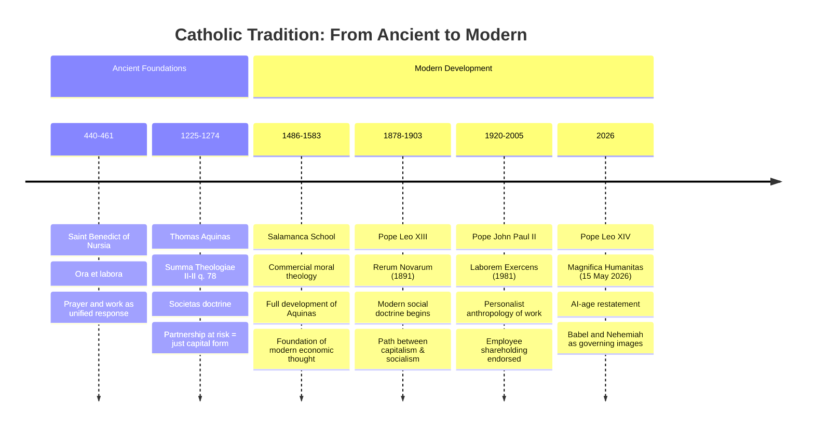

# Doctrinal Lineage: A Living Tradition

The LEP intellectual framework draws from two complementary religious and philosophical traditions that converge on a single answer: partnership is the just form of capital.

---

## Catholic tradition: from Roman law to *Magnifica Humanitas*

---

## Catholic tradition: figure notes

Each figure contributed a distinct move: from the dignity of work (Benedict), to the doctrinal distinction (Aquinas), to the commercial moral theology (Salamanca), to the modern social-encyclical arc (Leo XIII through Leo XIV).

### Saint Benedict (480 to 547)

The *Rule of Saint Benedict* opens the tradition by insisting that work and prayer are unified as the human response to God. Labor is dignified, not degrading. Every subsequent Catholic argument about the moral weight of economic life stands on that claim.

### Thomas Aquinas (1225 to 1274)

In *Summa Theologiae* II-II q. 78, Aquinas draws on Roman commercial law to establish the distinction that organizes the rest of the tradition. Capital deployed into a partnership at shared risk earns a return justly, because the investor remains a co-owner who shares the loss. The same capital extended as a loan at fixed interest (*mutuum*) is usury, because the lender keeps the capital safe and demands a return as well. *Societas* is just because the investor's profit follows from actual contribution at actual risk. The program's entire doctrinal framework turns on that distinction.

### Salamanca School (1486 to 1583)

Francisco de Vitoria, Domingo de Soto, and Luis de Molina developed the Aquinas distinction into a full commercial moral theology. They wrote for confessors of merchants, which means the work is practical: the just price, the legitimate partnership return, the doctrine of restitution, the early monetary theory driven by New World silver inflation. The principles they set down were still governing commercial doctrine five hundred years later.

### Pope Leo XIII (1810 to 1903)

*Rerum Novarum* (1891) reopened the tradition after a century's silence and brought it into dialogue with industrial capitalism. Leo XIII charted a path between unbridled capitalism and socialism by insisting that just capital deployment required authentic partnership: shared contribution, shared risk, aligned interests.

### Pope John Paul II (1920 to 2005)

*Laborem Exercens* (1981) reframed work through a personalist lens: the person is the subject of work, never its object. Section 14 explicitly endorses employee shareholding as the model in which workers share in ownership, risk, and reward. The personalist argument is the philosophical complement to the Aquinas distinction: both insist that the investor and the laborer must stand in genuine partnership.

### Pope Leo XIV and *Magnifica Humanitas* (2026)

The most recent articulation of the lineage addresses artificial intelligence and algorithmic capitalism. Taking Babel (fragmentation, misalignment) and Nehemiah (rebuilding through community) as its governing biblical images, the encyclical asks how the *societas* principle applies when capital is deployed not into a venture between identifiable partners but into platforms that extract value from those who provide the data.

---

## Jewish tradition: Torah to Maimonides to the *heter isqa*

The Jewish tradition reaches the same conclusion through independent reasoning, beginning from the Torah and moving through Talmudic commercial jurisprudence to Maimonides's systematic ranking of the forms of *tzedakah*.

### Biblical Foundations

Leviticus 25:35-36 grounds the partnership obligation: "So that he may live with you." The verse is not a command to relieve; it is a command to sustain through community. The poor person should live *with* you, as a partner, not as an object of pity.

Deuteronomy 16:20 supplies the doubled imperative: "Justice, justice shall you pursue." The repetition is not decoration. It insists that the means and the end must both be just. How you pursue justice is as morally weighty as whether you pursue it.

### Maimonides (1138 to 1204)

In *Mishneh Torah*, Hilkhot Mattenot Aniyim 10:7 to 14, Maimonides ranked eight levels of *tzedakah* in ascending order of moral merit. The highest is *shutafut*, partnership with the recipient: strengthening his hand so that he need not beg. The climactic insight is that engaging the poor person *as a partner* in creating his own livelihood is more just than any form of giving, however generous or anonymous.

The eight rungs, from lowest to highest:

1. Giving reluctantly, with a pained heart
2. Giving cheerfully, but still one-directional
3. Giving after being asked
4. Giving before being asked
5. Giving where the recipient knows the donor but the donor does not know the recipient
6. Giving where the donor knows the recipient but the recipient does not know the donor
7. Giving where neither party knows the other
8. *Shutafut* (partnership): enabling the poor person to support themselves through employment or business partnership

Partnership ranks highest because it restores dignity by creating mutual obligation rather than dependence. The recipient becomes a partner with a stake in the outcome, not an object of another person's virtue.

---

## Convergence: one principle, two routes

The two traditions reason from different premises through different methods and arrive at the same place. Aquinas names *societas* as the just form of capital; Maimonides names *shutafut* as the highest rung of justice. The principle is one: capital deployed in genuine partnership at genuine risk is just, and capital that secures a fixed return by transferring risk to the other party is not.

> The just form of engaging capital with those in poverty is partnership at shared risk.

---

## The year-theme as application

The program treats entrepreneurship as a contested question, not an affirmed answer. One reading holds entrepreneurship as the direct route out of poverty: job creation, wealth generation, entrepreneurial agency as the exercise of dignity. The other holds it as a producer of poverty through wage suppression, risk externalization, and winner-take-all dynamics.

The *societas*/*shutafut* framework provides the test. The answer turns on the form of the enterprise: whether workers and investors share risk and return in genuine partnership, or whether the structure extracts value from one side while concentrating upside on the other. The year-theme asks which fact patterns fall on which side of that line.

---

## Further reading

### Primary Sources
- Thomas Aquinas, *Summa Theologiae* II-II, Questions 78-79
- Maimonides, *Mishneh Torah*, Hilkhot Mattenot Aniyim
- Pope Leo XIII, *Rerum Novarum* (1891)
- Pope John Paul II, *Laborem Exercens* (1981)
- Pope Leo XIV, *Magnifica Humanitas* (2026)

### Secondary Sources
- James F. Keenan (ed.), *Catholic moral thought and the corporation*
- Avery Cardinal Dulles, *Social teaching of the Church*
- Michael Sherwin & Romanus Cessario (eds.), *Thomistic moral theory*
- Adele Reinhartz, *Debt and forgiveness in Jewish exilic literature*

---

## Questions for seminar use

1. What makes partnership fundamentally different from charity in terms of human dignity?
2. How does the *societas* doctrine apply to modern corporation structures?
3. What would *shutafut*-based entrepreneurship look like in practice today?
4. Can artificial intelligence be engaged with through a partnership framework, or does it necessarily involve extraction?
5. What historical examples best illustrate successful partnership models?
