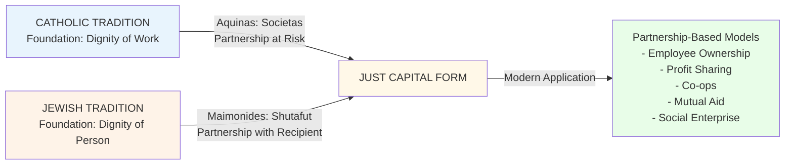

# Two Traditions, One Answer

Both the Catholic and Jewish intellectual traditions tackle the same fundamental question: **What is the just way to engage capital with those in poverty?**

Though using different theological frameworks and historical contexts, they arrive at remarkably similar conclusions through careful moral reasoning.

---

## Side-by-Side Comparison

---

## Detailed Framework Comparison

### Core Assumptions

#### Catholic Framework
**Starting Point:** *"Ora et labora"* (Prayer and Work)

- Work is a fundamental human activity, not punishment
- Labor is dignified when it respects the person
- Justice requires alignment of interests in economic relations
- The community has obligation to support those who cannot work

**Goal:** Just structures that align incentives and respect dignity

#### Jewish Framework
**Starting Point:** *"So that he may live with you"* (Leviticus 25:35)

- The poor person is community, not charity case
- Dignity is restored through partnership, not dependency
- Justice requires both the "what" (helping) and the "how" (just means)
- The highest form of justice creates conditions for self-sufficiency

**Goal:** Restoring dignity through active partnership

---

### The Problem Both Identify

**Catholic Analysis (Aquinas):**
- *Mutuum* (fixed-interest lending) is unjust because:
  - Lender profits regardless of outcome
  - Borrower bears all risk
  - Interests are misaligned
  - Dignity is violated through dependency

**Jewish Analysis (Maimonides):**
- One-way charity is insufficient because:
  - Creates dependency
  - Violates recipient's dignity
  - Lacks genuine relationship
  - Leaves person vulnerable

**Shared Concern:** Extraction-based models that externalize risk and create power imbalances

---

### The Solution Both Propose

#### Catholic: *Societas* (Partnership at Shared Risk)

**Definition:** Two or more persons entering into partnership where:
- All parties contribute capital, labor, or expertise
- All parties share in both profits and losses
- Interests are naturally aligned
- Dignity is preserved through mutuality

**Biblical Basis:** Roman commercial law (available to Aquinas)

**Modern Examples:**
- Employee stock ownership plans (ESOPs)
- Profit-sharing cooperatives
- Joint ventures with shared liability
- Employee-owned businesses

#### Jewish: *Shutafut* (Partnership with the Recipient)

**Definition:** The highest form of *tzedakah* where:
- Helper enables recipient to create own livelihood
- Both parties invest in the outcome
- Relationship is reciprocal
- Dignity is restored through participation

**Talmudic Basis:** Maimonides' eight rungs, ascending from charity to partnership

**Modern Examples:**
- Microfinance partnerships
- Mentorship with equity stake
- Training + employment programs
- Community development corporations

---

### Key Differences in Approach

| Dimension | Catholic | Jewish |
|-----------|----------|--------|
| **Primary Framework** | Natural law + Theological virtue | Scriptural obligation + Talmudic reasoning |
| **Economic Theory** | Aristotelian; property is natural | Covenant-based; property is stewardship |
| **Historical Development** | Systematic philosophy (Scholasticism) | Interpretive tradition (Talmud) |
| **Primary Metaphor** | *Societas* (partnership) | *Shutafut* (companionship) |
| **Starting Assumption** | Work is dignifying | Community is fundamental |
| **Scale of Application** | Individual choice to corporate structures | Individual to communal obligation |

---

### Key Similarities in Conclusion

Both traditions agree:

1. **Charity is necessary but insufficient**
   - Catholic: It addresses immediate need but doesn't restructure injustice
   - Jewish: One-way charity violates recipient dignity

2. **Partnership is the highest form**
   - Catholic: *Societas* is the just economic form
   - Jewish: *Shutafut* is the highest rung of *tzedakah*

3. **Mutual interest alignment matters**
   - Catholic: Profit must follow from shared contribution and shared risk
   - Jewish: Both parties must have stake in outcome

4. **Justice is both means AND ends**
   - Catholic: Unjust structures corrupt even good intentions
   - Jewish: "Justice, justice shall you pursue"—the how matters as much as the what

5. **Community has structural obligation**
   - Catholic: Church and state must support just economic structures
   - Jewish: Community must ensure conditions for dignity and self-sufficiency

---

## The year-theme as application

### *Entrepreneurship v. Poverty*

How do we know if an entrepreneurial venture is just or unjust?

**Test 1: Alignment of Interests**
- Does risk distribution match contribution?
- Do profit incentives align with stakeholder welfare?
- Or are risks externalized to workers/communities?

**Test 2: Dignity & Agency**
- Does it restore dignity or create dependency?
- Are participants active partners or passive recipients?
- Does it build community or extract value?

**Test 3: Sustainability**
- Can the model persist without exploitation?
- Does it create conditions for future generations?
- Or does it depend on depleting resources/people?

### Examples Through This Lens

**Just: Employee-Owned Tech Cooperative**
- ✓ Workers own equity (shared risk)
- ✓ Profits distributed proportionally
- ✓ Workers have governance voice
- ✓ Aligned incentives for quality and sustainability

**Unjust: Gig Economy Platform**
- ✗ Workers have no equity (all risk externalized)
- ✗ Profits concentrated to platform owners
- ✗ Workers have no control over terms
- ✗ Incentives misaligned (platform profits from cutting wages)

**Uncertain: Fair-Trade Coffee Cooperative**
- ? Producers have ownership stake
- ? Pricing protects producers but limits scale
- ? Consumers have choice but pay premium
- ? Model is sustainable but limited to engaged market

---

## How the program uses both traditions

The LEP approach weaves both traditions together:

- **From Catholic thought:** Systematic framework for analyzing economic justice through the lens of *societas*
- **From Jewish thought:** Deep commitment to dignity and community, grounded in covenantal obligation
- **Combined:** A practical theology for 21st-century enterprise

---

## Questions for seminar use

1. **Where do you see *societas* or *shutafut* principles in modern business?**

2. **What structural changes would be needed to make partnership the default, rather than the exception?**

3. **How do the two traditions complement each other? Where do they potentially conflict?**

4. **Can AI and algorithmic systems ever be engaged through a partnership framework?**

5. **What would it mean for your organization to adopt *societas*/*shutafut* principles?**

---

## Further Reading

### Primary Sources
- Thomas Aquinas, *Summa Theologiae* II-II, Q. 78-79 on partnership (*societas*)
- Maimonides, *Mishneh Torah*, Hilkhot Mattenot Aniyim 10:7-14 (eight rungs of charity)
- Pope Leo XIII, *Rerum Novarum* (1891) - foundational modern social encyclical
- Pope John Paul II, *Laborem Exercens* (1981) - on the dignity of work

### Secondary Scholarly Works
- Romanus Cessario, *The Moral Virtues and Theological Ethics* (on Aquinas)
- Margaret Curran, *Catholic Social Teaching: A Contemporary Introduction*
- Avery Dulles, *Models of the Church* (on community and structure)
- Adele Reinhartz, *Debt and Forgiveness in Jewish Exilic Literature*
- Meir Tamari, *The Challenge of Wealth: A Jewish Perspective on Earning and Spending Money*

---

## Further reading and related pages

- Explore [the full Doctrinal Lineage](/LEP/lineage-timeline/)
- Read about [*Societas* in practice](/LEP/societas/)
- Join the discussion at our [next public forum](/LEP/events/)
