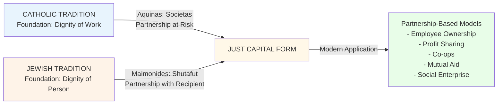

# Two Traditions, One Answer

The Catholic and Jewish intellectual traditions reason from different premises through different methods and arrive at the same answer: partnership at shared risk is the just form of capital deployment.

---

## Side-by-side comparison

---

## Detailed framework comparison

Both traditions are set out below in parallel, beginning from each tradition's foundational premise, moving through its operative doctrine, and arriving at the shared conclusion.

### Catholic framework

The Catholic tradition opens with *ora et labora*: work and prayer are the unified human response to God. Labor is dignified when it respects the person who performs it, and justice requires that the economic structures surrounding labor align the interests of everyone who participates. The tradition arrives at the practical conclusion that just structures share incentives rather than externalizing risk onto the weaker party.

### Jewish framework

The Jewish tradition opens with Leviticus 25:35: "So that he may live with you." The poor person is community, not a case for relief. Dignity is restored through partnership rather than charity, and the tradition insists that justice governs both the ends and the means. The highest form of *ẓedakah* creates conditions for self-sufficiency rather than conditions for continued dependence.

---

### The shared diagnosis

Aquinas identifies the same structural defect in *mutuum* that Maimonides identifies in one-way charity: the lender or donor profits regardless of outcome while the other party bears all the risk. When the lender's return is fixed in advance, interests diverge. When the donor's virtue is confirmed by the gift, the recipient's dignity is not. Both traditions name this structural misalignment as the problem to be solved, not a side effect to be managed.

---

### The shared solution

Each tradition arrives at partnership through its own doctrinal path.

#### Catholic: *societas* (partnership at shared risk)

Aquinas took the Roman commercial law of the *exercitor navis*, the shipowner who shared liability with the venture's investors, and formalized it as the structure in which capital deployment becomes just. In *societas*, all parties contribute capital, labor, or expertise; all share in both profits and losses; and the investor's return follows from actual contribution at actual risk. The structural logic is that shared stakes produce aligned interests. Modern applications of the *societas* principle include employee stock ownership plans, profit-sharing cooperatives, joint ventures with shared liability, and employee-owned businesses.

#### Jewish: *shutafut* (partnership with the recipient)

Maimonides names *shutafut* as the highest of the eight rungs of *ẓedakah*: the helper enables the recipient to create his own livelihood, both parties invest in the outcome, and the relationship is reciprocal rather than one-directional. The *heter iska* contract in Jewish commercial law gives the same logic commercial form: capital is deployed half as loan and half as deposit-at-risk, so that return follows shared risk. Modern applications include microfinance partnerships, mentorship arrangements with an equity component, and community development corporations.

---

### Key differences

| Dimension | Catholic | Jewish |
|---|---|---|
| **Primary Framework** | Natural law + Theological virtue | Scriptural obligation + Talmudic reasoning |
| **Economic Theory** | Aristotelian; property is natural | Covenant-based; property is stewardship |
| **Historical Development** | Systematic philosophy (Scholasticism) | Interpretive tradition (Talmud) |
| **Primary Metaphor** | *Societas* (partnership) | *Shutafut* (companionship) |
| **Starting Assumption** | Work is dignifying | Community is fundamental |
| **Scale of Application** | Individual choice to corporate structures | Individual to communal obligation |

---

### Key convergences

Both traditions treat charity as necessary but insufficient. Catholic social teaching holds that addressing immediate need without restructuring the economic relationship leaves the injustice intact. Maimonides holds that one-way charity, however anonymous and generous, violates the recipient's dignity because it confirms rather than dissolves the asymmetry between giver and recipient.

Both traditions place partnership at the apex of the moral hierarchy. *Societas* is the just economic form for Aquinas; *shutafut* is the highest rung of *ẓedakah* for Maimonides. The move is the same in both: genuine partnership aligns interests structurally, so that the investor's profit and the laborer's livelihood depend on the same outcome.

Both traditions insist that just means and just ends cannot be separated. Unjust structures corrupt good intentions. "Justice, justice shall you pursue" requires that the how answer to the same standard as the what.

Both traditions place a structural obligation on the community, not only on individuals. The obligation to build and sustain just economic arrangements falls on the institutions that govern commercial life, not only on the parties to any particular transaction.

---

## The year-theme as application

The program's 2026–27 year-theme, *Entrepreneurship: Curing Poverty*, runs the *societas*/*shutafut* framework through the question of which structures actually carry the cure.

### *Entrepreneurship: Curing Poverty*

The *societas*/*shutafut* framework supplies three diagnostic questions for evaluating any enterprise. First, does risk distribution match contribution? If workers absorb downside while investors capture upside, the structure is *mutuum* wearing the costume of partnership. Second, does participation build the capacity for self-sufficiency, or does it create a new form of dependence? Agency, governance voice, and the ability to exit without catastrophic loss matter as much as compensation. Third, can the model persist without depleting the people or communities it engages? A structure that generates returns by consuming its participants is extracting, not partnering.

### Examples

An employee-owned technology cooperative illustrates the *societas* principle in practice. Workers own equity and therefore share the risk; profits are distributed proportionally to contribution; governance voice is structural. The incentives for quality and sustainability align because the people whose labor creates value also bear the consequences of the venture's choices.

A gig economy platform illustrates the opposite. Workers bear all the operational risk with no equity stake; profits concentrate with platform owners; workers exercise no control over the terms that govern their work; the platform's incentive to cut wages is exactly misaligned with workers' interests. The structure satisfies the formal conditions of a market transaction while collapsing the substantive conditions of partnership.

A fair-trade coffee cooperative sits in between. Producers hold an ownership stake and pricing protections, which is the right direction. But the model's reach is constrained by premium-market consumers and its sustainability depends on continued consumer choice rather than structural obligation. Whether it satisfies the *shutafut* standard turns on whether the producer relationship is genuinely reciprocal or whether it reproduces the asymmetry in a more comfortable form.

---

## How the program uses both traditions

The program draws the systematic analytical framework from the Catholic tradition: the *societas*/*mutuum* distinction gives a precise doctrinal test for reading economic structures. From the Jewish tradition it draws the anthropological insistence that dignity is constituted through relationship and that the highest form of justice restores the other person's capacity for self-direction. The two together produce a practical theology adequate to the actual complexity of twenty-first-century enterprise.

---

## Questions for seminar use

1. Where do you see *societas* or *shutafut* principles in modern business?

2. What structural changes would be needed to make partnership the default?

3. How do the two traditions complement each other? Where do they potentially conflict?

4. Can AI and algorithmic systems ever be engaged through a partnership framework?

5. What would it mean for your organization to adopt *societas*/*shutafut* principles?

---

## Further reading

### Primary Sources
- Thomas Aquinas, *Summa Theologiae* II-II, Q. 78-79
- Maimonides, *Mishneh Torah*, Hilkhot Mattenot Aniyim 10:7-14
- Pope Leo XIII, *Rerum Novarum* (1891)
- Pope John Paul II, *Laborem Exercens* (1981)

### Secondary Sources
- Romanus Cessario, *The Moral Virtues and Theological Ethics*
- Margaret Curran, *Catholic Social Teaching: A Contemporary Introduction*
- Avery Dulles, *Models of the Church*
- Adele Reinhartz, *Debt and Forgiveness in Jewish Exilic Literature*
- Meir Tamari, *The Challenge of Wealth: A Jewish Perspective on Earning and Spending Money*

---

## Related pages

- [Doctrinal Lineage](/LEP/lineage-timeline/)
- [*Societas* in practice](/LEP/societas/)
- [Events](/LEP/events/)
