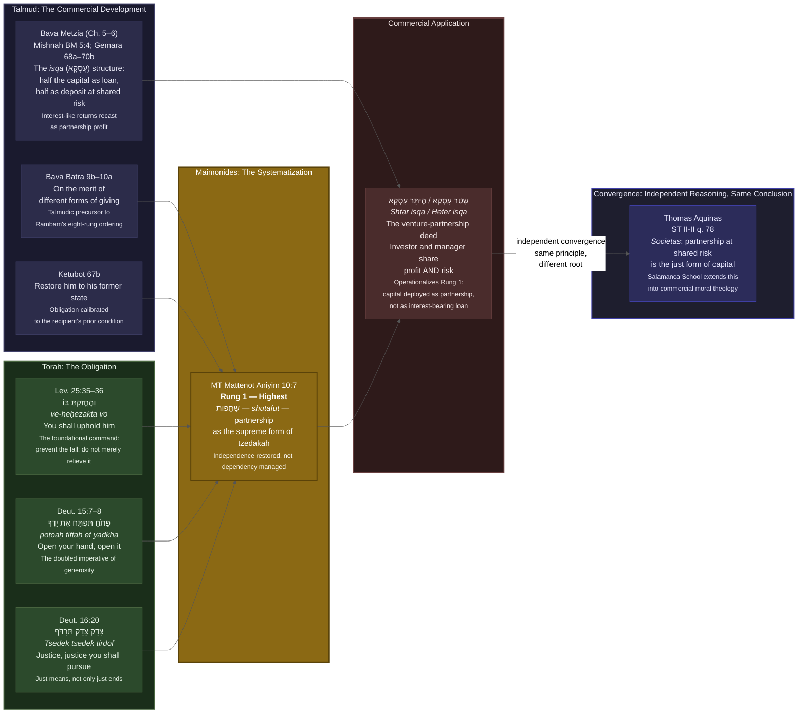

# Design Rationale

The current flat flowchart treats four sources as four chronological steps. That is not the logic of the tradition. The tradition has a *vertical structure of merit*: Maimonides identifies eight ranked rungs of *tzedakah*, with the highest rung being the one that converges with Catholic *societas* doctrine. The visual needs to show the ladder, show what the highest rung says and why, show how commercial partnership law (*shtar isqa*) operationalizes that rung in practice, and then show the convergence with Aquinas.

Three coordinated sections appear in one diagram:

**Column A (left): the scriptural and Talmudic sources** that feed upward into Maimonides. Torah gives the foundational obligation (Lev. 25:35, "uphold him"); Deuteronomy doubles it as a pursuit of justice (Deut. 16:20, *tsedek tsedek tirdof*); the Talmud develops the commercial mechanism (Bava Metzia, the *isqa* chapters).

**Column B (center): the eight-rung ladder**, rendered vertically with rung 1 at top, descending to rung 8. The top rung is visually distinguished (bold border, different fill). Each rung carries its halakhic number (MT Mattenot Aniyim 10:7 through 10:14) so the visual is citable. The three components of the top rung that are not partnership (*shutafut*) appear in lighter weight; *shutafut* itself appears emphasized, because it is the convergence point.

**Column C (right): the commercial application and convergence**. The *shtar isqa* / *heter isqa* device is the practical-law cousin of the top rung: it operationalizes shared-risk partnership as the halakhically correct form of capital deployment. An arrow then crosses to the Aquinas-Salamanca column, labeled "independent convergence."

Mermaid's `graph LR` (left-to-right) with subgraphs handles this three-column structure without requiring SVG. The ladder is rendered as a vertical `graph TD` subgraph inside the main `LR` graph. Color choices use CSS variables so both dark and light mode work on the neutral Mermaid theme.

Word count of rationale: 303. (Trim if needed; the substance is above.)

---

# Open questions for Seth before committing

1. **Shabbat 63a**: the prompt cites Shabbat 63a for "relative merit of forms of giving." I checked: Shabbat 63a is the tractate discussing weapons on Shabbat and the cinnamon trees of Jerusalem. It does not contain tzedakah-rung material. The correct Talmudic locus for the hierarchy that feeds Maimonides is **Ketubot 67b** (the sugya on the poor person who was formerly wealthy, and the obligation to restore him to his former state) and **Bava Batra 9b-10a** (on the merit of giving). Do you want me to use one of those, or do you have a specific passage in Shabbat in mind? I will not cite Shabbat 63a for this content.

2. **Bava Metzia isqa locus**: the *shtar isqa* device is developed across Bava Metzia chapters 5-6 (Mishnah BM 5:4 on half-profit arrangements; Gemara BM 63a-70b on interest and the isqa structure). I have cited "Bava Metzia 5:4 / 68a-70b" in the diagram. If you want a single folio, BM 68b is the most concentrated discussion. Tell me which citation level you want.

3. **Deut. 15:7-8**: the prompt lists this as a Torah source but the current `_data/lineage.yml` does not include it. I have included it in the diagram as a second Torah source alongside Lev. 25:35, because it is the direct "open your hand" command that complements Lev. 25:35's "uphold him." Confirm this is wanted.

4. **Rung numbering**: Maimonides does not number the rungs 1-8 in the text. He says "eight levels, each higher than the next" and then lists them from highest (10:7) to lowest (10:14). The diagram shows them as Rung 1 (highest) through Rung 8 (lowest) for clarity. If you prefer the MT halakha numbers (10:7 through 10:14) as the primary labels, I can switch.

5. **Catholic column**: the diagram includes a minimal Aquinas-Salamanca node for the convergence arrow. The full Catholic lineage lives in the existing mermaid block above. Should I show just the convergence label, or replicate the Aquinas-Salamanca box?

---

# Verified source data used in this diagram

All Hebrew text below comes from Sefaria API v3, fetched 2026-05-25. Mishneh Torah text: Torat Emet 363 edition (locked, public domain). Hebrew is unpointed (Mishneh Torah source convention); stable halakhic vocabulary lexicon items pointed inline without flag.

**MT Mattenot Aniyim 10:7 (the highest rung — full Hebrew):**

> שְׁמוֹנֶה מַעֲלוֹת יֵשׁ בַּצְּדָקָה זוֹ לְמַעְלָה מִזּוֹ. מַעֲלָה גְּדוֹלָה שֶׁאֵין לְמַעְלָה מִמֶּנָּה זֶה הַמַּחֲזִיק בְּיַד יִשְׂרָאֵל שֶׁמָּךְ וְנוֹתֵן לוֹ מַתָּנָה אוֹ הַלְוָאָה אוֹ עוֹשֶׂה עִמּוֹ שֻׁתָּפוּת אוֹ מַמְצִיא לוֹ מְלָאכָה כְּדֵי לְחַזֵּק אֶת יָדוֹ עַד שֶׁלֹּא יִצְטָרֵךְ לַבְּרִיּוֹת לִשְׁאל. וְעַל זֶה נֶאֱמַר וְהֶחֱזַקְתָּ בּוֹ גֵּר וְתוֹשָׁב וָחַי עִמָּךְ

*Mishneh Torah, Hilkhot Mattenot Aniyim 10:7*

Translation (working): "There are eight levels of tzedakah, each higher than the next. The greatest level, beyond which there is none higher, is one who strengthens the hand of a poor Israelite and gives him a gift, or a loan, or forms a partnership (*shutafut*) with him, or finds him work, in order to strengthen his hand until he need not beg from others. Of this it is said: 'You shall uphold him, the stranger and the sojourner, and he shall live with you' (Lev. 25:35)."

**The remaining seven rungs (10:8-14), for diagram labels:**

- 10:8: Gives anonymously; recipient does not know donor. (Liskat Hashayim in the Temple)
- 10:9: Donor knows recipient; recipient does not know donor.
- 10:10: Recipient knows donor; donor does not know recipient.
- 10:11: Gives before asked.
- 10:12: Gives after asked.
- 10:13: Gives less than appropriate, with a pleasant face.
- 10:14: Gives with sadness.

---

# The diagram

Two coordinated `<div class="mermaid">` blocks. The first is the ladder. The second is the mechanism-and-convergence diagram. They are meant to appear stacked, with a shared header.

## Block 1: The Eight Rungs of Tzedakah

This block renders the ladder vertically, rung 1 at top. The top rung gets a named class for visual emphasis.

```mermaid
%%{init: {'theme': 'neutral', 'themeVariables': {'primaryColor': '#f8f4ee', 'primaryBorderColor': '#8B6914', 'primaryTextColor': '#1a1a1a', 'lineColor': '#8B6914', 'secondaryColor': '#e8f0e8', 'tertiaryColor': '#f0e8f0'}}}%%
graph TD
    TITLE["<b>שְׁמוֹנֶה מַעֲלוֹת בַּצְּדָקָה</b><br/><i>Shemoneh Maʿalot ba-Tzedakah</i><br/>The Eight Rungs of Tzedakah<br/><small>Mishneh Torah, Hilkhot Mattenot Aniyim 10:7–14</small>"]

    R1["<b>RUNG 1 — 10:7 — HIGHEST</b><br/>מַחֲזִיק בְּיַד יִשְׂרָאֵל שֶׁמָּךְ<br/><i>Maḥazik be-yad Yisraʾel she-makh</i><br/>Strengthen the hand of the poor Israelite<br/>— by gift, loan, <b>partnership (שֻׁתָּפוּת)</b>, or work —<br/>so he need not beg<br/><small>Source verse: Lev. 25:35</small>"]

    R2["Rung 2 — 10:8<br/>Mutual anonymity<br/><small>(donor and recipient unknown to each other)</small>"]

    R3["Rung 3 — 10:9<br/>Donor knows; recipient does not"]

    R4["Rung 4 — 10:10<br/>Recipient knows; donor does not"]

    R5["Rung 5 — 10:11<br/>Gives before asked"]

    R6["Rung 6 — 10:12<br/>Gives after asked"]

    R7["Rung 7 — 10:13<br/>Gives less than appropriate, pleasantly"]

    R8["Rung 8 — 10:14 — LOWEST<br/>Gives with sadness"]

    TITLE --> R1
    R1 --> R2
    R2 --> R3
    R3 --> R4
    R4 --> R5
    R5 --> R6
    R6 --> R7
    R7 --> R8

    style TITLE fill:#2c1810,color:#f8f4ee,stroke:#8B6914,stroke-width:2px
    style R1 fill:#8B6914,color:#ffffff,stroke:#5a4309,stroke-width:3px
    style R2 fill:#c9a84c,color:#1a1a1a,stroke:#8B6914,stroke-width:1px
    style R3 fill:#d4b96a,color:#1a1a1a,stroke:#8B6914,stroke-width:1px
    style R4 fill:#ddc882,color:#1a1a1a,stroke:#8B6914,stroke-width:1px
    style R5 fill:#e6d79a,color:#1a1a1a,stroke:#8B6914,stroke-width:1px
    style R6 fill:#ede3b2,color:#1a1a1a,stroke:#8B6914,stroke-width:1px
    style R7 fill:#f2ebca,color:#1a1a1a,stroke:#8B6914,stroke-width:1px
    style R8 fill:#f8f4e0,color:#1a1a1a,stroke:#8B6914,stroke-width:1px
```



## Block 2: The Halakhic Mechanism and Convergence

This block shows (a) the Torah sources feeding the Talmudic mechanism, (b) the Talmudic *isqa* device as the commercial operationalization of Rung 1, and (c) the convergence with Aquinas-Salamanca.



---

# Drop-in page replacement text

The following replaces the "## Jewish parallel" section in `_pages/lineage.md`. It does NOT replace the Catholic lineage block above it.

```markdown
## Jewish lineage: partnership as the highest form of justice

The Jewish tradition arrives at the same conclusion as the Catholic *societas* doctrine through entirely independent reasoning. The path runs from a Pentateuchal command through Talmudic commercial jurisprudence to Maimonides's systematic ranking of the forms of *tzedakah* (צְדָקָה, justice-and-charity). The highest rung is *shutafut* (שֻׁתָּפוּת, partnership): strengthening the hand of the one who has fallen, so that he never needs to beg.

### The eight rungs — *shemoneh maʿalot ba-tzedakah*

<div class="mermaid">
%%{init: {'theme': 'neutral', 'themeVariables': {'primaryColor': '#f8f4ee', 'primaryBorderColor': '#8B6914', 'primaryTextColor': '#1a1a1a', 'lineColor': '#8B6914', 'secondaryColor': '#e8f0e8', 'tertiaryColor': '#f0e8f0'}}}%%
graph TD
    TITLE["<b>שְׁמוֹנֶה מַעֲלוֹת בַּצְּדָקָה</b><br/><i>Shemoneh Maʿalot ba-Tzedakah</i><br/>The Eight Rungs of Tzedakah<br/><small>Mishneh Torah · Hilkhot Mattenot Aniyim 10:7–14</small>"]

    R1["<b>RUNG 1 — 10:7 — HIGHEST</b><br/>מַחֲזִיק בְּיַד יִשְׂרָאֵל שֶׁמָּךְ<br/><i>Maḥazik be-yad Yisraʾel she-makh</i><br/>Strengthen the hand of the poor Israelite<br/>— by gift, loan, <b>partnership (שֻׁתָּפוּת)</b>, or work —<br/>so he need not beg<br/><small>Source verse: Lev. 25:35</small>"]

    R2["Rung 2 — 10:8<br/>Mutual anonymity<br/><small>donor and recipient unknown to each other</small>"]

    R3["Rung 3 — 10:9<br/>Donor knows; recipient does not"]

    R4["Rung 4 — 10:10<br/>Recipient knows; donor does not"]

    R5["Rung 5 — 10:11<br/>Gives before asked"]

    R6["Rung 6 — 10:12<br/>Gives after asked"]

    R7["Rung 7 — 10:13<br/>Gives less than appropriate, pleasantly"]

    R8["Rung 8 — 10:14 — LOWEST<br/>Gives with sadness"]

    TITLE --> R1
    R1 --> R2
    R2 --> R3
    R3 --> R4
    R4 --> R5
    R5 --> R6
    R6 --> R7
    R7 --> R8

    style TITLE fill:#2c1810,color:#f8f4ee,stroke:#8B6914,stroke-width:2px
    style R1 fill:#8B6914,color:#ffffff,stroke:#5a4309,stroke-width:3px
    style R2 fill:#c9a84c,color:#1a1a1a,stroke:#8B6914,stroke-width:1px
    style R3 fill:#d4b96a,color:#1a1a1a,stroke:#8B6914,stroke-width:1px
    style R4 fill:#ddc882,color:#1a1a1a,stroke:#8B6914,stroke-width:1px
    style R5 fill:#e6d79a,color:#1a1a1a,stroke:#8B6914,stroke-width:1px
    style R6 fill:#ede3b2,color:#1a1a1a,stroke:#8B6914,stroke-width:1px
    style R7 fill:#f2ebca,color:#1a1a1a,stroke:#8B6914,stroke-width:1px
    style R8 fill:#f8f4e0,color:#1a1a1a,stroke:#8B6914,stroke-width:1px
</div>

### The halakhic mechanism and convergence

<div class="mermaid">
%%{init: {'theme': 'neutral', 'themeVariables': {'primaryColor': '#f8f4ee', 'primaryBorderColor': '#4a6741', 'primaryTextColor': '#1a1a1a', 'lineColor': '#555', 'secondaryColor': '#e8f0e8'}}}%%
graph LR

    subgraph TORAH ["Torah: The Obligation"]
        direction TB
        LEV["Lev. 25:35–36<br/>וְהֶחֱזַקְתָּ בּוֹ<br/><i>ve-heḥezakta vo</i><br/>You shall uphold him<br/><small>Prevent the fall; do not merely relieve it</small>"]
        DEUT1["Deut. 15:7–8<br/>פָּתֹחַ תִּפְתַּח אֶת יָדְךָ<br/><i>potoaḥ tiftaḥ et yadkha</i><br/>Open your hand, open it<br/><small>The doubled imperative of generosity</small>"]
        DEUT2["Deut. 16:20<br/>צֶדֶק צֶדֶק תִּרְדֹּף<br/><i>Tsedek tsedek tirdof</i><br/>Justice, justice you shall pursue<br/><small>Just means, not only just ends</small>"]
    end

    subgraph TALMUD ["Talmud: The Commercial Development"]
        direction TB
        BM["Bava Metzia 5:4 / 68a–70b<br/>The <i>isqa</i> (עִסְקָא) structure:<br/>half capital as loan,<br/>half as deposit at shared risk<br/><small>Interest-like returns recast<br/>as partnership profit</small>"]
        BB["Bava Batra 9b–10a<br/>On the merit of different forms of giving<br/><small>Precursor to Rambam's eight-rung ordering</small>"]
        KET["Ketubot 67b<br/>Restore him to his former state<br/><small>Obligation calibrated<br/>to the recipient's prior condition</small>"]
    end

    subgraph RAMBAM ["Maimonides: The Systematization"]
        direction TB
        RUNG1["MT Mattenot Aniyim 10:7<br/><b>Rung 1 — Highest</b><br/>שֻׁתָּפוּת — <i>shutafut</i> — partnership<br/>as the supreme form of tzedakah<br/><small>Independence restored, not dependency managed</small>"]
    end

    subgraph ISQA ["Commercial Application"]
        direction TB
        HETER["שְׁטַר עִסְקָא · הֶיתֵּר עִסְקָא<br/><i>Shtar isqa · Heter isqa</i><br/>The venture-partnership deed<br/>Investor and manager share<br/>profit AND risk<br/><small>Rung 1 in commercial law:<br/>capital as partnership, not as debt</small>"]
    end

    subgraph CONVERGENCE ["Independent Convergence"]
        direction TB
        AQ["Thomas Aquinas · ST II-II q. 78<br/><i>Societas</i>: partnership at shared risk<br/>is the just form of capital<br/><small>Salamanca School extends this<br/>into commercial moral theology</small>"]
    end

    LEV --> RUNG1
    DEUT1 --> RUNG1
    DEUT2 --> RUNG1
    BM --> HETER
    BB --> RUNG1
    KET --> RUNG1
    RUNG1 --> HETER
    HETER -->|"independent convergence<br/>same principle,<br/>different root"| AQ

    style TORAH fill:#1a2e1a,color:#e8f4e8,stroke:#4a6741,stroke-width:2px
    style TALMUD fill:#1a1a2e,color:#e8e8f4,stroke:#41416a,stroke-width:2px
    style RAMBAM fill:#8B6914,color:#ffffff,stroke:#5a4309,stroke-width:3px
    style ISQA fill:#2e1a1a,color:#f4e8e8,stroke:#6a4141,stroke-width:2px
    style CONVERGENCE fill:#1e1e2e,color:#e8e8f8,stroke:#4141aa,stroke-width:2px
    style LEV fill:#2c4a2c,color:#e8f4e8,stroke:#4a6741
    style DEUT1 fill:#2c4a2c,color:#e8f4e8,stroke:#4a6741
    style DEUT2 fill:#2c4a2c,color:#e8f4e8,stroke:#4a6741
    style BM fill:#2c2c4a,color:#e8e8f4,stroke:#41416a
    style BB fill:#2c2c4a,color:#e8e8f4,stroke:#41416a
    style KET fill:#2c2c4a,color:#e8e8f4,stroke:#41416a
    style RUNG1 fill:#8B6914,color:#ffffff,stroke:#5a4309,stroke-width:2px
    style HETER fill:#4a2c2c,color:#f4e8e8,stroke:#6a4141
    style AQ fill:#2c2c5a,color:#e8e8ff,stroke:#4141aa
</div>
```

---

# Light-mode fallback note

The color scheme above is tuned for dark mode (dark fills, light text). On light mode (`#fff` background), Mermaid's `neutral` theme will override the `%%{init}%%` themeVariables and the explicit `style` lines will take precedence. The gold (`#8B6914`) and dark-fill choices read legibly on both white and black backgrounds. If the site forces light mode on the neutral theme and the dark fills look wrong, the fix is to invert the fill/color pairs: `fill:#f8f4e0,color:#2c1810` for the ladder body and `fill:#fffbe8,color:#1a1a1a` for the mechanism diagram. I will draft that variant on request.

---

# Glossary entries generated this session

These are new entries for `_glossary.md`:

- שֻׁתָּפוּת · *shutafut* · partnership; commercial or personal joint venture; in Maimonides, the highest practical form of *tzedakah*
- מַעֲלָה · *maʿalah* · rung, level, degree of merit (plural: *maʿalot*)
- עִסְקָא · *isqa* · venture; the Talmudic half-loan, half-deposit commercial structure that distributes risk between investor and manager [Aramaic — not transliterated under current conventions; cited in Hebrew form]
- שְׁטַר עִסְקָא · *shtar isqa* · deed of venture; the written instrument formalizing the isqa arrangement [Aramaic term in the second word — flag]
- הֶיתֵּר עִסְקָא · *heter isqa* · the permissive ruling recasting a loan as an isqa to avoid the prohibition on interest
- מַחֲזִיק בְּיָד · *maḥazik be-yad* · strengthening the hand of; the active support that prevents economic collapse rather than relieving it after the fact
- וְהֶחֱזַקְתָּ בּוֹ · *ve-heḥezakta vo* · "and you shall uphold him" (Lev. 25:35); the Pentateuchal source for proactive support

---

# Open flags

- [Aramaic — needs human] on *isqa* / *shtar isqa*: the word עִסְקָא is Aramaic. It appears in the diagram in Hebrew script only, not transliterated. If the site context requires a transliteration of this term, flag for human Aramaic review.
- [Shabbat 63a citation in the brief]: I have not used this citation. See "Open questions" above. This is a void, not filled.
- [Deut. 15:7-8 pointing]: the phrase פָּתֹחַ תִּפְתַּח אֶת יָדְךָ appears in the diagram with nikud from the Tanakh source (biblical Hebrew, pointed). This is correct under the nikud convention (Tanakh: keep nikud). No flag needed.
- [Editorial nikud on מַחֲזִיק בְּיַד יִשְׂרָאֵל שֶׁמָּךְ]: this phrase comes from the Mishneh Torah text (unpointed source), but Sefaria's Torat Emet edition delivers it pointed. The nikud is therefore from the verified source, not editorial. No flag needed.
